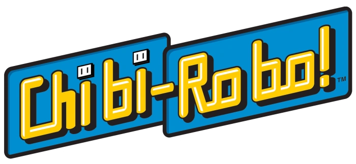

# Chibi-Robo Patch

Play **Wii de Asobu: Chibi-Robo!** (*New Play Control! Chibi-Robo!*, Wii, `R24J01`) with a
**GameCube controller** or a **Classic Controller** instead of a Wii Remote and
Nunchuk. Works on the Japanese release, including the fan English translation
of it (same disc id).

The patches are applied to your own copy of the game: drop a clean `.wbfs` or
`.iso` onto the patcher and play the result on a Wii (USB loader) or in Dolphin.
Nothing from the game is included in this repository.



## Controls

| Pad | Move | Pointer | A / B | 1 | Nunchuk Z / C | + / - / HOME |
|---|---|---|---|---|---|---|
| Classic Controller | left stick | right stick | A / B | X | ZL or L / Y | + / - / HOME |
| GameCube controller | stick | C-stick | A / B | X | L / Y | START / Z / -- |

The D-pad is the D-pad. The right stick / C-stick steers the pointer (menus,
the photo and spotlight pointer) a little each frame, in proportion to how far
it is pushed.

## Status

Checked in Dolphin with scripted input, on the English-translated image: the
"Connect a Nunchuk to the Wiimote" banner is gone, the pointer follows the
C-stick / right stick, A on the title screen opens the New Game menu, and the
status the game receives for every button and both sticks is correct for a
GameCube pad and a Classic Controller. **Not tested on a real Wii, and not played
past the file-select screen.**

- a Wii Remote must stay connected (also with the GameCube pad)
- plug the GameCube pad in before starting the game

## Using it

- **Patched disc:** `python3 tools/gui.py` (or the packaged app), or
  `python3 tools/patch_disc.py "Chibi-Robo.wbfs"`. Needs
  [wit](https://wit.wiimm.de/) on `PATH`. The original is kept as `<name>.bak`.
- **Riivolution:** `riivolution/R24J01.xml`.

There is no Gecko code list: the routines come to about 440 lines and Dolphin's
code handler has room for about 230. The routines live in low memory at
`0x80001820-0x80003000`; do not combine the Riivolution patch with a loader's own
code handler on a real Wii.

## Building

```
CHIBI_DOLS=<dir with R24J01.dol> python3 tools/gen_prebuilt.py    # needs devkitPPC
python3 tools/build.py        # riivolution/
python3 tools/check.py        # consistency checks
```

`tools/dtest.py` is the Dolphin test harness (GDB-stub memory access, pipe input).
